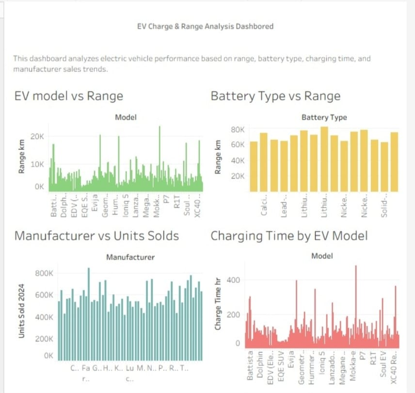

# EV-Charge-Range-Analysis-Tableau
Electric Vehcile Charge and Range Analysis Dashbored using Tableau
# EV Charge & Range Analysis Dashboard (Tableau)

This project presents an interactive dashboard created using Tableau to analyze electric vehicle performance.

## Project Overview
The dashboard analyzes electric vehicle performance based on:
- EV model range
- Battery type vs range
- Manufacturer sales trends
- Charging time by EV model

## Tools Used
- Tableau Public
- Data Visualization
- EV dataset

## Dashboard Preview

## Tableau Public Dashboard Link
View the interactive dashboard here:
https://public.tableau.com/app/profile/varan.singh/viz/EVChargeRangeAnalysisDashbored/Dashboard1?publish=yes
